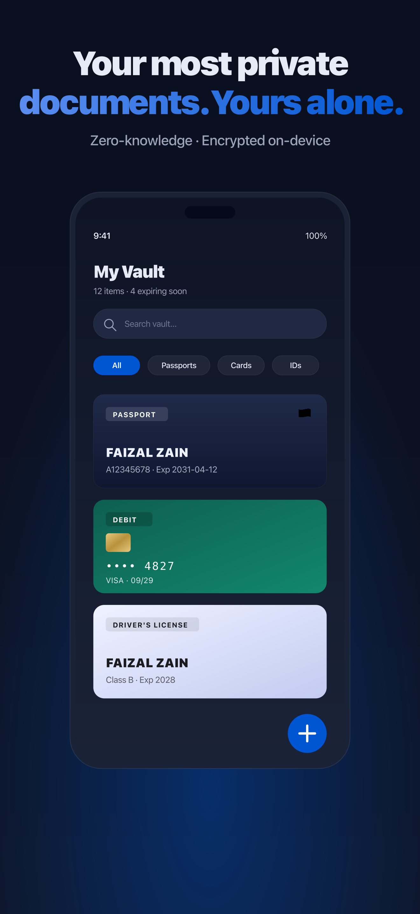
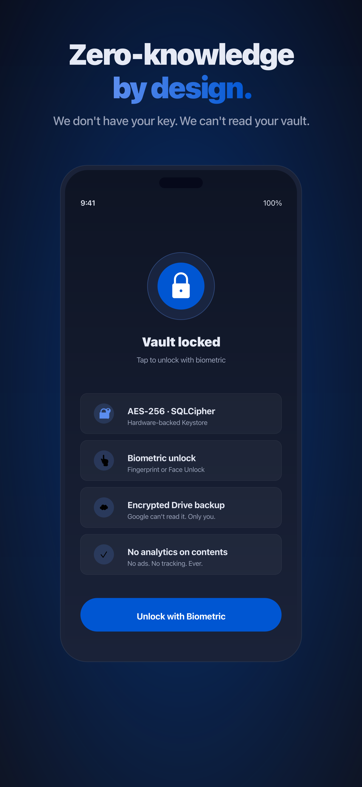
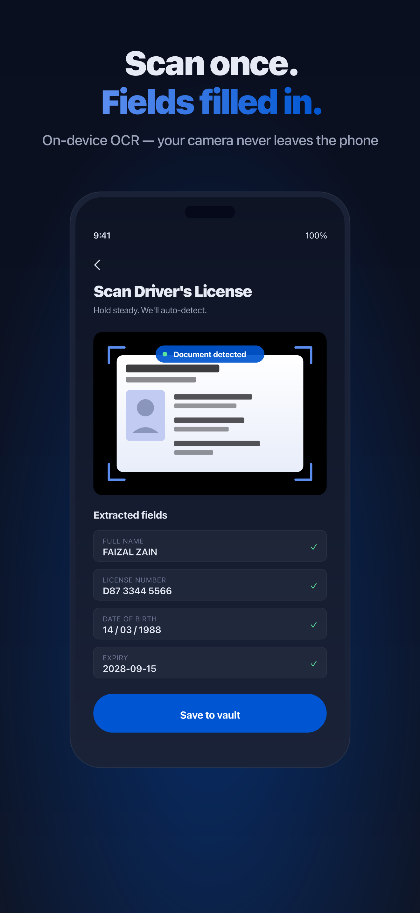

# Kryptos (iOS)

[]()
[](https://github.com/mfaizalzain/KryptosiOS/actions/workflows/build-test.yml)

A privacy-first digital vault for your identity documents, payment cards, and sensitive records — built with SwiftUI and SwiftData. Store everything encrypted on-device, back up to your own Google Drive, and unlock with biometrics.

> **Companion app:** [Kryptos (Android)](https://github.com/mfaizalzain/KryptosAndroid) — the same zero-knowledge vault for Android, with NFC chip reading and AI document scanning.

## 📱 Screenshots

<p align="center">
  
  
  
</p>

## ✨ Features

- **Encrypted vault** — all entries encrypted at rest with AES-256-GCM (CryptoKit); keys live in the iOS Keychain and never leave the device. The SwiftData store uses `cloudKitDatabase: .none` — nothing leaves the device unless you back it up.
- **Biometric unlock** — Face ID / Touch ID with a secure lock screen.
- **10 built-in templates** — ID card, passport, driver's license, birth certificate, payment card, bank account, tax number, API key, note, and QR code.
- **Smart document scanning** — snap a passport, ID, or payment card and let on-device VisionKit / Live Text extract the fields. Camera frames never leave your phone.
- **Smart cards** — payment cards render with masked numbers and expiry badges; documents show photo slots and key-value fields.
- **QR code support** — generate QR codes for contacts (vCard), Wi-Fi, email, SMS, phone, geo location, calendar events, and payments; scan QR codes to auto-fill entries or share an entry to another Kryptos device fully offline.
- **Google Drive backup** — encrypted vault + recovery key backed up to your own Google Drive (`appDataFolder`), with restore and multi-account support.
- **Expiry reminders** — local notifications when documents and cards are about to expire.
- **Secure clipboard** — copied values auto-clear after 30 seconds.
- **In-app purchase** — one-time "Remove Ads" purchase (StoreKit 2).

## 🗂 Project structure

```
Kryptos/
├── App/                 # App entry point, ModelContainer setup
│   └── KryptosApp.swift
├── Models/              # Domain models & templates
│   └── VaultModels.swift
├── Services/            # Business logic, separated by concern
│   ├── BackupModels.swift           # Backup payload + recovery key models
│   ├── BillingService.swift         # StoreKit 2 purchases
│   ├── DriveAPIClient.swift         # Google Drive REST client
│   ├── DriveBackupService.swift     # Google Drive backup/restore
│   ├── ExpiryReminderService.swift  # Local notification scheduling
│   ├── GoogleAuthModels.swift       # Google Sign-In DTOs
│   ├── GoogleAuthService.swift      # Google Sign-In & token management
│   ├── QRCode.swift                 # QR image generation
│   ├── QRPayloadBuilder.swift       # QR payload formats (vCard, Wi-Fi, geo…)
│   └── SecurityServices.swift       # Keychain, encryption, clipboard
└── Views/               # SwiftUI screens & components
    ├── RootView.swift               # Navigation & auth gate
    ├── VaultListView.swift          # Entry list + search
    ├── EntryDetailView.swift        # Entry detail with QR share
    ├── EntryDetailComponents.swift  # Reusable detail components
    ├── EntryEditorView.swift        # Entry create/edit
    ├── FieldEditorRow.swift         # Per-field editor with input rules
    ├── VaultHeroCard.swift          # Hero cards for payment/documents
    ├── DocumentScanView.swift       # VisionKit document scanning
    ├── QRScannerView.swift          # Camera QR scanning
    ├── QRTypePicker.swift           # QR type selection
    └── AccountSettingsView.swift    # Sign-in, backup, ads, danger zone
```

## 🛠 Requirements

- **Xcode 26.6** (iOS 26.5 SDK) — macOS 15+ (do **not** archive from beta macOS; Apple rejects ITMS-90111)
- **iOS deployment target:** 26.0
- **Swift 6 language mode** (`SWIFT_VERSION = 6.0`) with `SWIFT_DEFAULT_ACTOR_ISOLATION = MainActor` and `SWIFT_APPROACHABLE_CONCURRENCY`
- No external Swift Package dependencies — pure Apple frameworks (auto-updated with the SDK).

## 🚀 Getting started

```bash
git clone https://github.com/mfaizalzain/KryptosiOS.git
cd KryptosiOS
open Kryptos.xcodeproj
```

Select the **Kryptos** scheme and run on a simulator or device. Google Sign-In requires a valid `GoogleService-Info.plist` and the client ID configured for your bundle ID — add yours to the target if you're building your own copy.

## 🔐 Security notes

- Vault store is excluded from iCloud backup; Drive backups are encrypted and per-account (`kryptos-ios-vault.json` + `kryptos-ios.key`).
- The recovery key is required to restore a backup on a new device — store it somewhere safe.
- Clipboard auto-clears 30s after copying any field value.

## 🧪 Testing

Run the test suite with **Cmd+U** (`KryptosTests` target). Coverage is currently minimal — QR payload builder and field codec tests are the next priority.

## 📦 Releases

Builds are archived locally (Xcode 26.6, Cloud Managed Apple Distribution) and uploaded to App Store Connect via `altool`. See `marketing/README.md` for the full upload checklist, including the ITMS-90111 workaround (stable `BuildMachineOSBuild` patch before export).

## 🤝 Contributing

Bug reports, feature requests, and PRs are welcome. Please open an issue first to discuss significant changes — this is a small personal project, so expect a light review cycle.

## ☕ Support

Like Kryptos? [Buy me a coffee](https://www.buymeacoffee.com/faizalmzain). Privacy policy and FAQ: [kryptos.faizalmzain.com](https://kryptos.faizalmzain.com).

## 📄 License

Public repository — all rights reserved. Copyright © 2024–2026 Faizal Zain.
